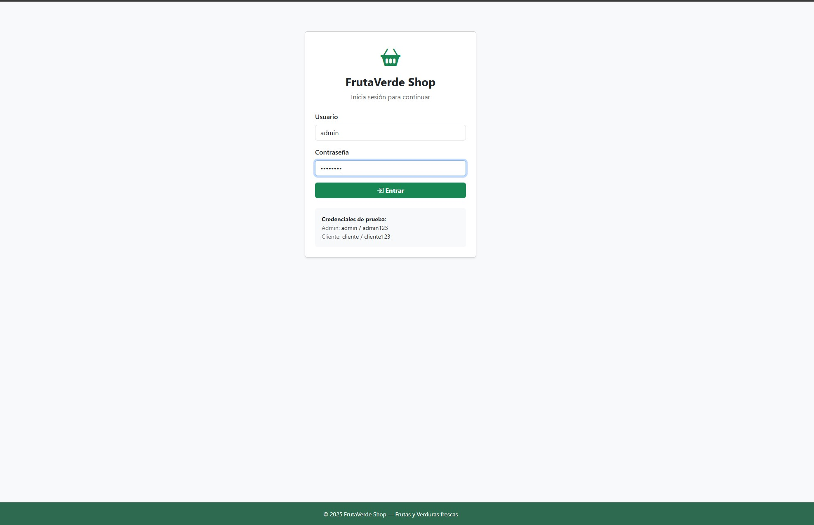
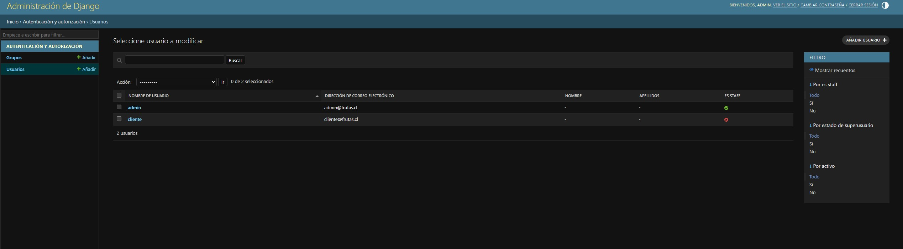
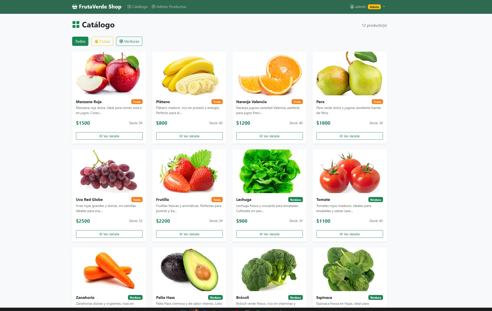
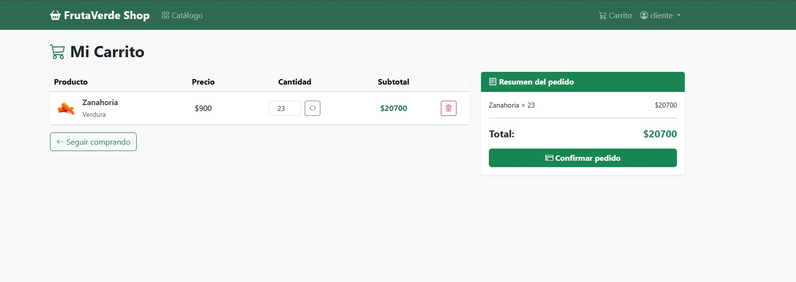

# FrutaVerde Shop — E-commerce Django

E-commerce de frutas y verduras desarrollado con Django + Bootstrap 5. Proyecto final del Módulo 8.

# Github Repositorio 
https://github.com/NicoAravena95/Modulo_8_Ecommerce

## Requisitos

- Python 3.10+
- Django 6.x (se instala con pip)

## Instalación

```bash
# 1. Clonar o descomprimir el proyecto
cd "modulo 8 - Ecommerce"

# 2. (Opcional) Crear entorno virtual
python -m venv venv
# Windows:
venv\Scripts\activate
# Mac/Linux:
source venv/bin/activate

# 3. Instalar Django
pip install django

# 4. Ejecutar setup inicial (migraciones + usuarios + productos)
python setup.py
```

## Cómo ejecutar

```bash
python manage.py runserver
```

Abrir en el navegador: **http://127.0.0.1:8000/**

## Credenciales de prueba

| Rol        | Usuario    | Contraseña     |
|------------|------------|----------------|
| Superadmin | superadmin | superadmin123  |
| Admin      | admin      | admin123       |
| Cliente    | cliente    | cliente123     |

## Rutas principales

| Ruta                     | Descripción                        | Acceso       |
|--------------------------|------------------------------------|--------------|
| `/login/`                | Iniciar sesión                     | Público      |
| `/logout/`               | Cerrar sesión                      | Autenticado  |
| `/catalogo/`             | Ver todos los productos            | Cliente/Admin|
| `/catalogo/?category=fruta`   | Filtrar por frutas            | Cliente/Admin|
| `/catalogo/?category=verdura` | Filtrar por verduras          | Cliente/Admin|
| `/producto/<id>/`        | Detalle del producto               | Cliente      |
| `/carrito/`              | Ver carrito                        | Cliente      |
| `/checkout/`             | Confirmar pedido                   | Cliente      |
| `/orden/<id>/exito/`     | Orden confirmada                   | Cliente      |
| `/admin-productos/`      | Listar productos (admin)           | Admin        |
| `/admin-productos/crear/`| Crear producto                     | Admin        |
| `/admin-productos/editar/<id>/` | Editar producto             | Admin        |
| `/admin-productos/eliminar/<id>/` | Eliminar producto         | Admin        |

## Funcionalidades

- Login/logout con roles (admin y cliente)
- Catálogo de productos desde base de datos con filtro por categoría
- Detalle de producto con imagen
- Carrito: agregar, actualizar cantidad, eliminar productos
- Subtotales y total del carrito en tiempo real
- Checkout: confirmación de pedido y registro en base de datos
- Descuento de stock al confirmar compra
- Área de administración CRUD completa para productos
- Validaciones en formularios (precio > 0, stock >= 0, cantidades válidas)
- Mensajes de éxito/error en todas las acciones
- Bootstrap 5 con diseño responsivo

## Base de datos

SQLite (por defecto en Django). El archivo `db.sqlite3` se genera automáticamente al correr `setup.py`.

## Capturas de pantalla

### Login / Home


### Superadmin


### Catálogo


### Carrito



### Administración de productos


## Productos incluidos (fixture)

- **Frutas:** Manzana Roja, Plátano, Naranja Valencia, Pera, Uva Red Globe, Frutilla
- **Verduras:** Lechuga, Tomate, Zanahoria, Palta Hass, Brócoli, Espinaca
